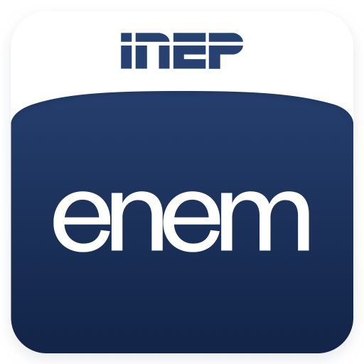

<meta charset="utf-8">
<h1 align="center">
    
</h1>

<h4 align="center">
  Quanto tempo falta para o enem?
</h4>

 

  

<!--  -->
  
  
  

  <a href="#rocket-tecnologias">Tecnologias</a>&nbsp;&nbsp;&nbsp;|&nbsp;&nbsp;&nbsp;
  <a href="#-projeto">Projeto</a>&nbsp;&nbsp;&nbsp;|&nbsp;&nbsp;&nbsp;
  <a href="#-layout">Layout</a>&nbsp;&nbsp;&nbsp;|&nbsp;&nbsp;&nbsp;
  <a href="#-como-contribuir">Como contribuir</a>&nbsp;&nbsp;&nbsp;|&nbsp;&nbsp;&nbsp;
  <a href="#memo-licença">Licença</a>

 

<!-- 

  

 -->

## :rocket: Tecnologias

Esse projeto está sendo desenvolvido com as seguintes tecnologias:

- [HTML](https://developer.mozilla.org/pt-BR/docs/Web/HTML)
- [CSS](https://developer.mozilla.org/pt-BR/docs/Web/CSS)
- [JavaScript](https://www.typescriptlang.orghttps://www.javascript.com)

## 💻 Projeto

Esse projeto visa ajudar a estudantes se atentarem a quanto tempo falta para o ENEM, para que nesse ano ninguém se atrase 😄.

## 🔖 Layout

Clique no link para acessar o projeto e conferir o layout:

- 📱 & 💻: [Quanto tempo falta para o ENEM?](https://quantotempofaltaproenem.vercel.app)

## ♻️ Como contribuir

- Faça um fork desse repositório;
- Cria uma branch com a sua feature: `git checkout -b minha-feature`;
- Faça commit das suas alterações: `git commit -m 'feat: Minha nova feature'`;
- Faça push para a sua branch: `git push origin minha-feature`.

Depois que o merge da sua pull request for feito, você pode deletar a sua branch.

## :memo: Licença

Esse projeto está sob a licença MIT. Veja o arquivo [LICENSE](LICENSE.md) para mais detalhes.

---

Feito com 💙 e ☕  por <strong><a href="https://www.linkedin.com/in/joaobispo2077/">João Bispo</a>😠</strong> 

